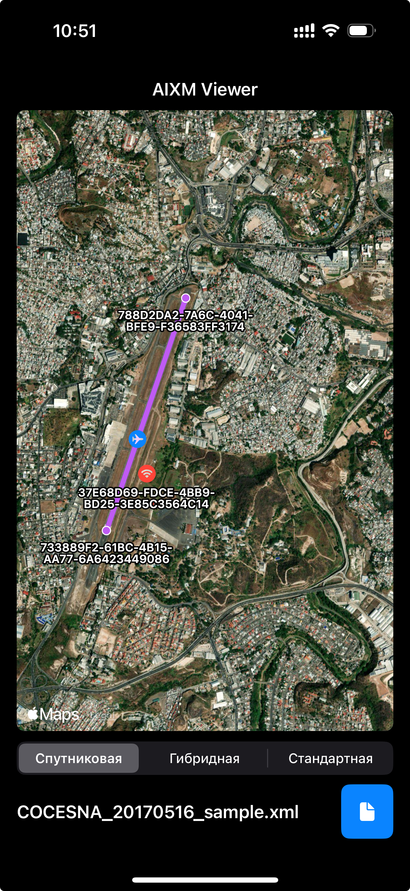

## Описание

**AIXM Viewer** — это iOS-приложение, разработанное на SwiftUI, для визуализации авиационных данных в формате AIXM (Aeronautical Information Exchange Model). Приложение позволяет загружать XML-файлы AIXM, парсить их и отображать объекты, такие как аэропорты, VOR (радионавигационные точки) и взлётно-посадочные полосы, на интерактивной карте с поддержкой различных стилей (стандартный, спутниковый, гибридный).


## Скриншоты



## Основные возможности

- Загрузка и парсинг XML-файлов AIXM.
- Отображение аэропортов, VOR и взлётных полос на карте с использованием `MapKit`.
- Переключение стилей карты: стандартный, спутниковый, гибридный.
- Интуитивный интерфейс с поддержкой файлового пикера и уведомлений.

## Требования

- Xcode 15.0 или новее
- iOS 17.0 или новее
- Swift 5.10

## Зависимости

Проект не использует сторонние зависимости, полагаясь только на стандартные фреймворки Apple:

- `SwiftUI`
- `MapKit`
- `Foundation`

## Структура проекта

```
AIXM-Viewer
├── AIXM_ViewerApp.swift
├── Assets
│   ├── Assets.xcassets
│   │   ├── AccentColor.colorset
│   │   │   └── Contents.json
│   │   ├── AppIcon.appiconset
│   │   │   ├── 1024 1.png
│   │   │   ├── 1024 2.png
│   │   │   ├── 1024.png
│   │   │   └── Contents.json
│   │   └── Contents.json
│   └── Preview Content
│       └── Preview Assets.xcassets
│           └── Contents.json
├── Constants.swift
├── Data
│   ├── COCESNA_20170516_sample.xml
│   └── Donlon.xml
├── Model
│   ├── MapItem.swift
│   ├── MapStyleType.swift
│   └── Runway.swift
├── View
│   ├── ContentView.swift
│   ├── FilePickerButton.swift
│   ├── MapView.swift
│   └── Markers.swift
└── ViewModel
    └── AIXM_Parser.swift
```

## Формат AIXM

Приложение поддерживает XML-файлы AIXM, содержащие следующие элементы:

- `AirportHeliport` (аэропорты, с координатами в теге `ARP`).
- `VOR` (радионавигационные точки, с координатами в теге `location`).
- `RunwayCentrelinePoint` (точки взлётных полос, с координатами в теге `location`).

Пример структуры:

```xml
<AIXM-Snapshot>
  <AirportHeliportTimeSlice>
    <ARP>
      <pos>55.408611 37.906111</pos>
    </ARP>
  </AirportHeliportTimeSlice>
  <VORTimeSlice>
    <location>
      <pos>55.441944 37.895833</pos>
    </location>
  </VORTimeSlice>
  <RunwayCentrelinePointTimeSlice>
    <location>
      <pos>55.400000 37.900000</pos>
    </location>
  </RunwayCentrelinePointTimeSlice>
</AIXM-Snapshot>
```

**Конец**
